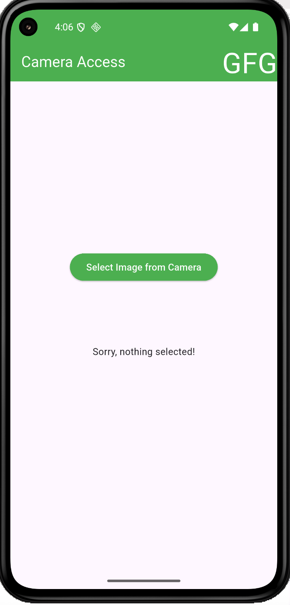

# CameraIntegrationDemo

A small app that takes a photo with the device camera through `image_picker` and shows it in the UI. It covers platform permissions and handling the case where no image is picked.

## Screenshot



## Run

```bash
flutter pub get
flutter run
```
