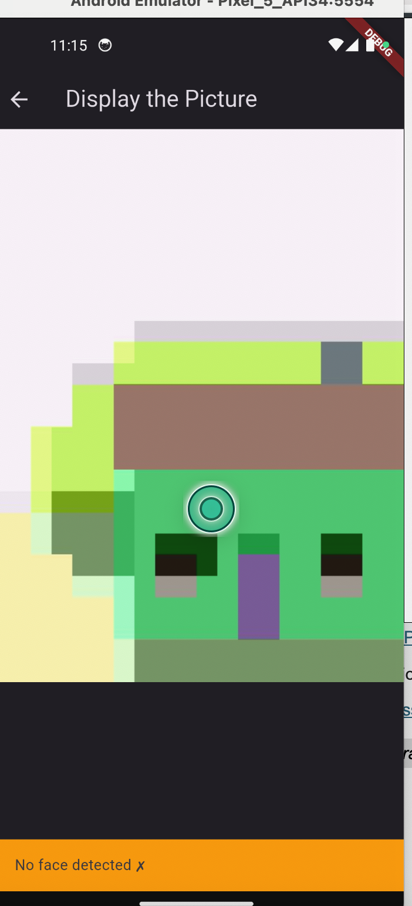

# FaceDetectorLite

A lighter version of [FaceDetectorPro](../FaceDetectorPro): take a photo, upload it to Firebase Storage, and run on-device face detection with ML Kit to report whether it contains a face. Push notifications are set up through Firebase Cloud Messaging.

## Features

- Camera capture and preview
- On-device face detection with `google_mlkit_face_detection`
- Upload to Firebase Storage
- FCM setup with foreground/background message handling

## Tech Stack

Flutter · camera · ML Kit · Firebase Storage · Firebase Messaging

## Screenshot



## Setup

This app uses Firebase. Config files are not committed, so connect it to your own project:

```bash
dart pub global activate flutterfire_cli
flutterfire configure     # writes lib/firebase_options.dart and the platform config files
flutter pub get
flutter run
```
