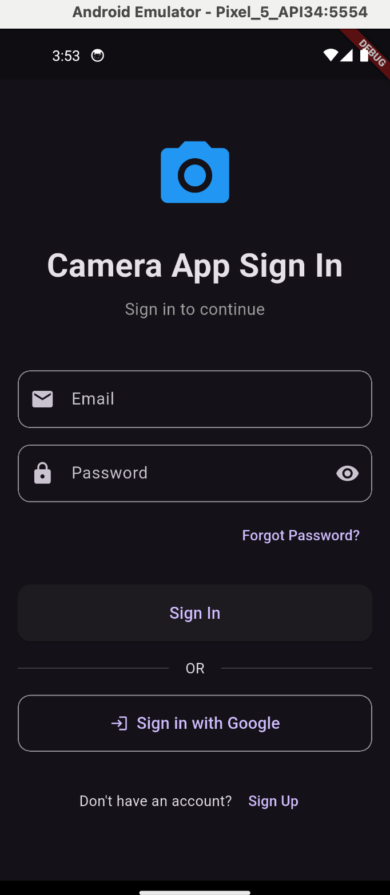

# FaceDetectorPro

A camera app that takes photos, checks them for faces on the device with Google ML Kit, uploads them to Firebase Storage, and keeps a photo history for each user in Cloud Firestore.

## Features

- Live camera preview and capture with the `camera` plugin
- On-device face detection with ML Kit, with the result shown on each photo
- Uploads to Firebase Storage; each photo's details (including whether a face was found) are saved to Cloud Firestore
- Photo history screen with details and delete
- Email/password and Google sign-in, plus password reset
- Firebase Cloud Messaging setup (shows the FCM token for sending test notifications)

## Tech Stack

Flutter · camera · google_mlkit_face_detection · Firebase Auth · Cloud Firestore · Firebase Storage · Firebase Messaging

## Screenshot



## Setup

This app uses Firebase. Config files are not committed, so connect it to your own project:

```bash
dart pub global activate flutterfire_cli
flutterfire configure     # writes lib/firebase_options.dart and the platform config files
flutter pub get
flutter run
```
