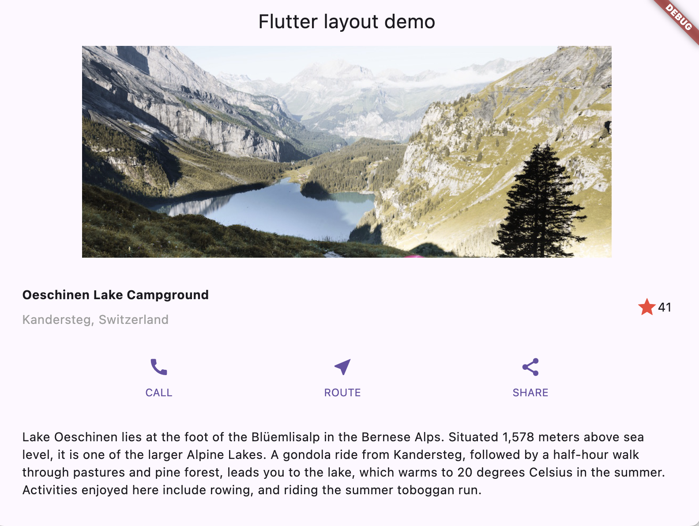
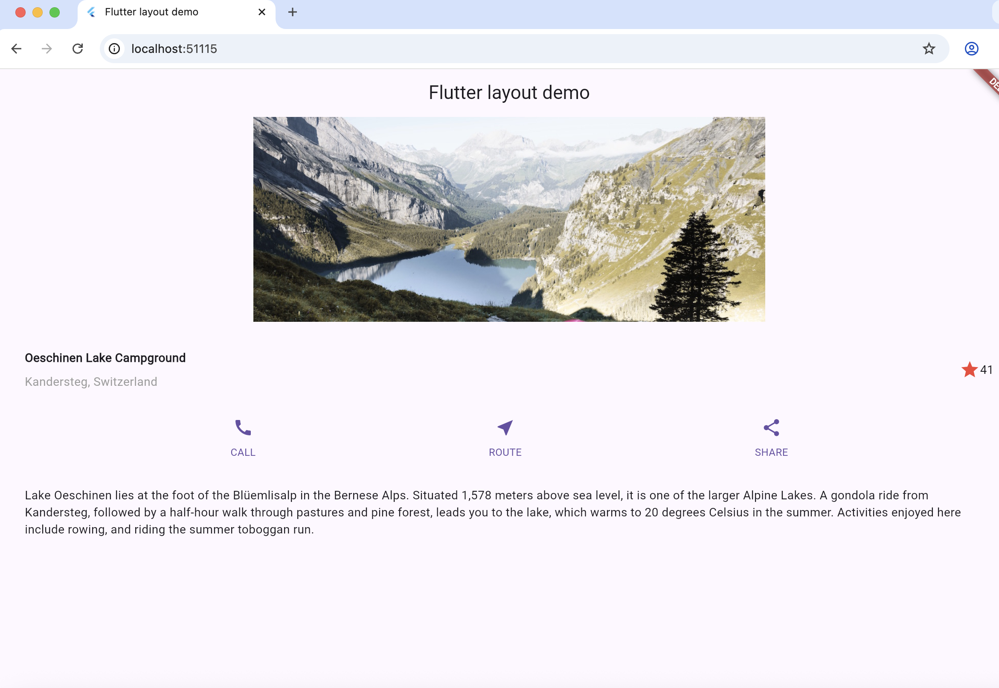

# FlutterLayoutShowcase

A detail page for a travel destination that shows how Flutter's layout widgets (`Row`, `Column`, `Expanded`, `Padding`, `Image`) fit together. It also has an interactive "favorite" button that keeps its own state.

## Screenshots

<p>
  
  
</p>

## Run

```bash
flutter pub get
flutter run
```
