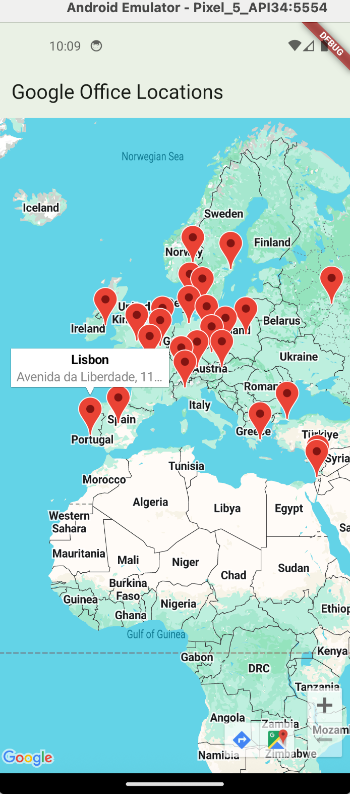
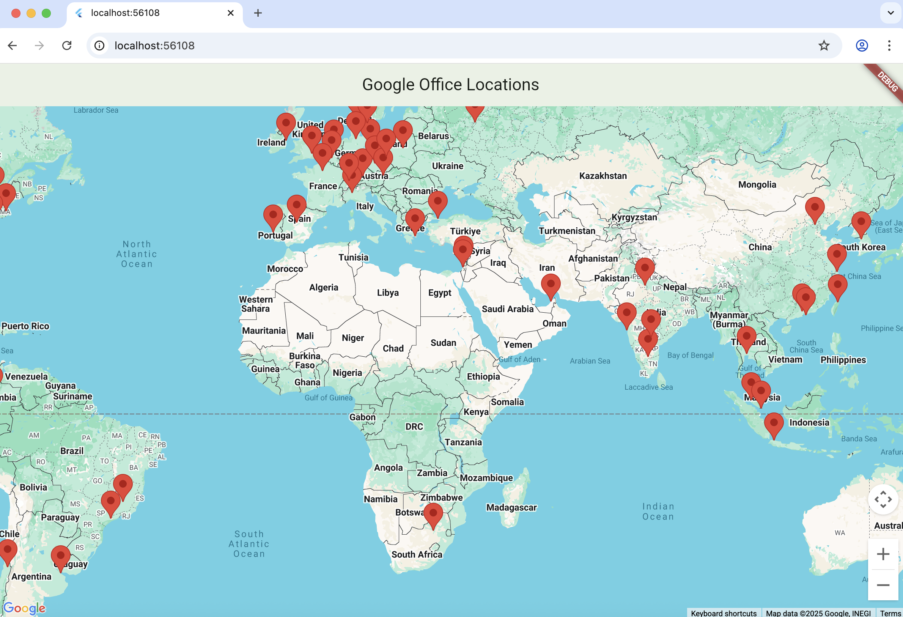

# GoogleMapsExplorer

Shows Google's offices around the world on an interactive map. Office data is fetched as JSON over HTTP and parsed into typed Dart models with `json_serializable`.

## Features

- Interactive map with a marker and info window for each office
- Live data from a remote JSON endpoint, with a bundled `assets/locations.json` as a fallback
- Type-safe JSON parsing with code generated by `build_runner`

## Tech Stack

Flutter · google_maps_flutter · http · json_serializable · build_runner

## Screenshots

<p>
  
  
</p>

## Setup

Add a Google Maps API key in `android/app/src/main/AndroidManifest.xml`, `ios/Runner/AppDelegate.swift`, and `web/index.html` (replace `YOUR_GOOGLE_MAPS_API_KEY`), then:

```bash
flutter pub get
dart run build_runner build   # regenerate models if you change them
flutter run
```
