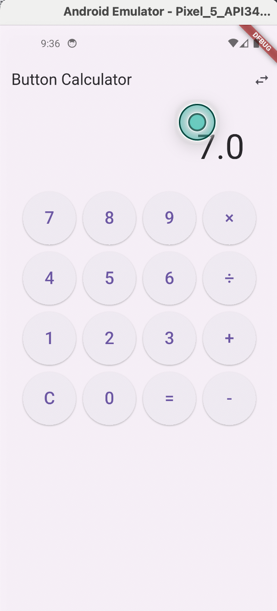
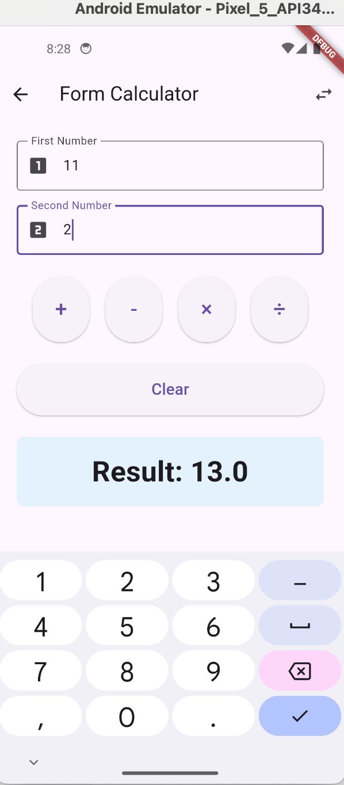

# ModernCalculator

A calculator with two input modes, built to practice state management and form handling in Flutter.

- **Button calculator**: keypad input for the four basic operations, with clear and divide-by-zero handling
- **Form calculator**: two validated number fields plus add, subtract, multiply, and divide

## Screenshots

<p>
  
  
</p>

## Run

```bash
flutter pub get
flutter run
```
