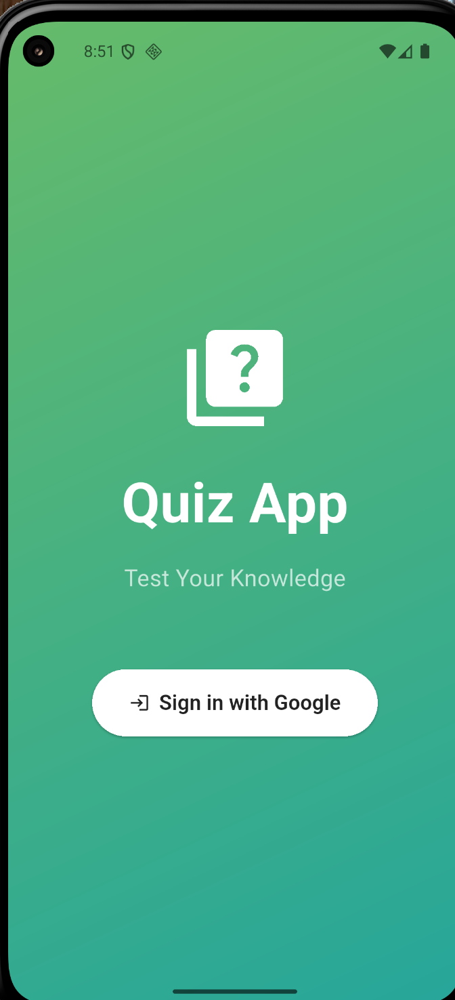
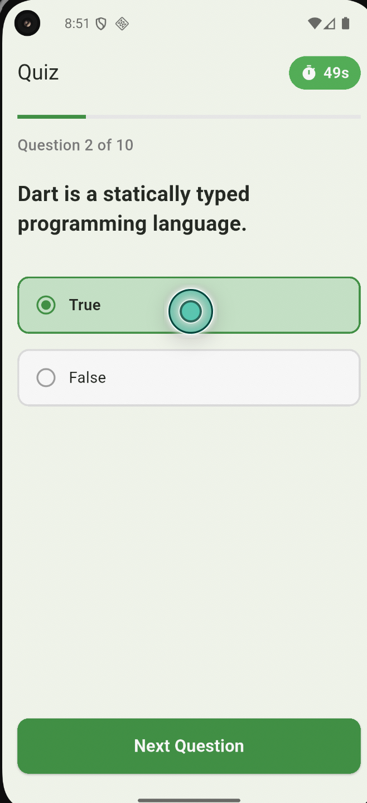
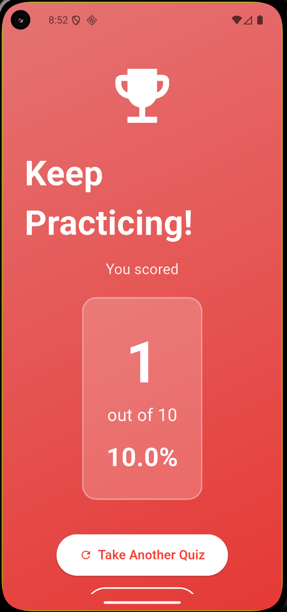

# QuizMaster

A quiz app backed by Firebase. Users sign in with Google, answer multiple-choice questions loaded from Firestore, and get a score breakdown. An admin panel manages the question bank.

## Features

- Google Sign-In through Firebase Authentication
- Questions loaded from Cloud Firestore, with progress tracking during the quiz
- Results screen with score, percentage, and feedback based on performance
- Results saved to Firestore (`quizResults`) for each user
- Admin panel that seeds the database with sample questions

## Tech Stack

Flutter · Firebase Auth · Google Sign-In · Cloud Firestore · Provider

## Screenshots

<p>
  
  
  
</p>

## Setup

This app uses Firebase. Config files are not committed, so connect it to your own project:

```bash
dart pub global activate flutterfire_cli
flutterfire configure     # writes lib/firebase_options.dart and the platform config files
flutter pub get
flutter run
```
