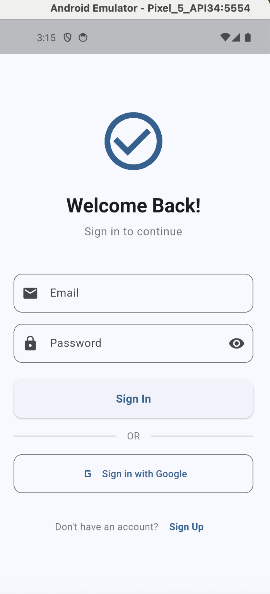
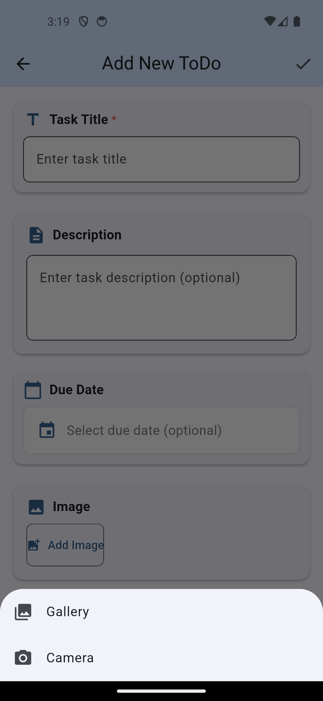

# TaskMaster

A to-do app with location support. You can attach an address or your current GPS position to a task, see it on Google Maps, check how far away it is, and add photos.

## Features

- Create, edit, complete, and delete tasks, stored in Cloud Firestore
- Paginated task list using Firestore cursors
- Attach a location by typing an address (geocoding) or using the current GPS position
- Map view of each task and its distance from you
- Attach photos from the camera or gallery
- Light/dark theme switching with Provider
- Demo sign-in flow that fills in sample tasks

## Tech Stack

Flutter · Cloud Firestore · Provider · google_maps_flutter · geolocator · geocoding · permission_handler · image_picker

## Screenshots

<p>
  
  
</p>

## Setup

Run `flutterfire configure` to connect your own Firebase project, then add a Google Maps API key to the Android manifest and iOS `AppDelegate.swift`.

```bash
flutter pub get
flutter run
```
