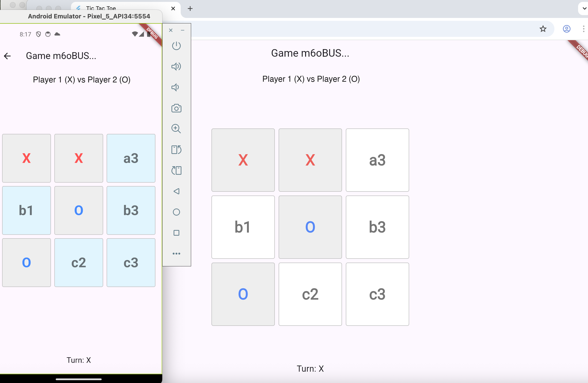

# TicTacToe Multiplayer

An online two-player Tic-Tac-Toe game. Players sign in with Google, create or join a game, and play turns that sync in real time through Cloud Firestore.

## Features

- Google Sign-In with a user profile stored in Firestore
- Lobby with waiting, active, and completed games
- Real-time board sync using Firestore snapshot listeners
- Turns are enforced, with win and draw detection
- Leaderboard of each player's wins, losses, and draws
- Firestore security rules and indexes in `firestore.rules` / `firestore.indexes.json`

## Tech Stack

Flutter · Firebase Auth · Google Sign-In · Cloud Firestore

## Screenshot



## Setup

This app uses Firebase. Config files are not committed, so connect it to your own project:

```bash
dart pub global activate flutterfire_cli
flutterfire configure     # writes lib/firebase_options.dart and the platform config files
flutter pub get
flutter run
```
